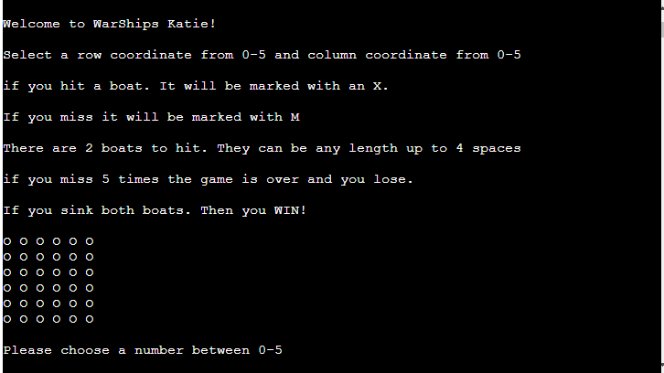
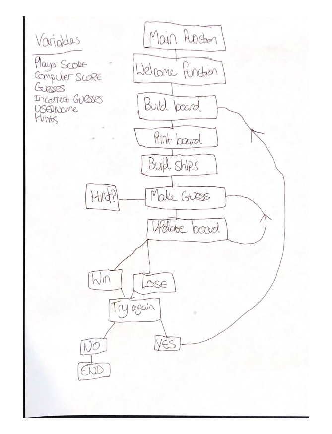

___
# **WarShips**

WarShips is a single player of a game known as [Battleships](https://en.wikipedia.org/wiki/Battleship_(game)). The aim of the game is to sink the opponants battleships before they sink yours. WarShips is slightly different where you are not playing against an opponant who is attacking your ships. Instead you have a limited amount of wrong guesses before you loose. The game gives you the opportunity to try and get as high as scrore as possible. But if you don't manage to sink the ships before your guesses deplete, then the computer wins. 
___

___
## **How to play** ##
The aim of the game is sink the computers battleships. The computer has 2 ships which will be of random length up to 4 coordinates. The user can make up to 5 incorrect guesses before the user looses. If the user sinks the 2 battleships within the incorrect guesses, then the user wins. A players correct guess will be marked on the game board (which is 6 rows of 0's by 6) by an X. Incorrect guesses will be marked with an M (for miss). The board will randomly generate 2 ships on the board each game, so every game will be different.  
___
___
## **Planning** ##
I drew out the planning of my code for the functions. I made a start and a way for it to end as well as including where while loops will be present.

## **Features** ##
___

## Creating the Heroku app

When you create the app, you will need to add two buildpacks from the _Settings_ tab. The ordering is as follows:

1. `heroku/python`
2. `heroku/nodejs`

You must then create a _Config Var_ called `PORT`. Set this to `8000`

