___
# **WarShips**

# [Click here to see deployed project](https://war-ships.herokuapp.com/) 

WarShips is a single player of a game known as [Battleships](https://en.wikipedia.org/wiki/Battleship_(game)). The aim of the game is to sink the opponants battleships before they sink yours. WarShips is slightly different where you are not playing against an opponant who is attacking your ships. Instead you have a limited amount of wrong guesses before you loose. The game gives you the opportunity to try and get as high as scrore as possible. But if you don't manage to sink the ships before your guesses deplete, then the computer wins. 
___

___
## **How to play** ##
The aim of the game is sink the computers battleships. The computer has 2 ships which will be of random length up to 4 coordinates. The user can make up to 5 incorrect guesses before the user looses. If the user sinks the 2 battleships within the incorrect guesses, then the user wins. A players correct guess will be marked on the game board (which is 6 rows of 0's by 6) by an X. Incorrect guesses will be marked with an M (for miss). The board will randomly generate 2 ships on the board each game, so every game will be different.  
___
___
## **Target Audience** ##
This game is aimed for an audience who enjoy hard games which puts you on edge. It will give the user tense moments as their guesses start to run out. It is also targeted towards gamers who enjoy trying to set score targets as the scoreboard gives the user to play limitless times for the user to try and score as many points as they possibly can. It is suited towards ages 10+ as coordinates can be a little tricky.
___
___
## **Planning** ##
I drew out the planning of my code for the functions. I made a start and a way for it to end as well as including where while loops will be present. I also planned which variable may need to be global so that they can be changed throughout the game and be used in multiple functions. Though the functions and variable did alter slightly when actually creating the code, the basic structure is still there.


- Project Goals

The project goals are to give a user the chance to play a logic game based on guesses and using available hints wisely. Game also provides the user to play again an opponent and try and win more times than the computer. The project also provides a game which the user can play as many times as they want whilst it being different every repition.
## **Features** ##
___
- USERNAME

The user has the opportunity to set a username.
The username will be used for the scoreboard and for when the game speaks to the player.

- BUILD AND PRINT GAME BOARD

Once a username has been set. The game will create a game board with a 6 by 6 dimention of O's. This will then be printed to the terminal by the main function.

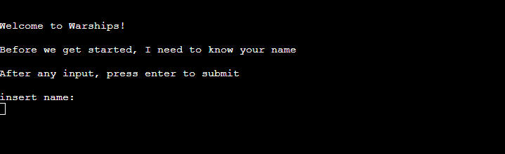
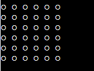

- INPUT FOR COORDINATES

The game will then make the user input a number for row and a number for column to give coordinates for their guess. If the guess hits a boat, the O at that coordinate will change to an X. If the guess misses it will chage to a M. The input will only let you input a number between 0-5.

- HINT

At the beginning of the game after the first shot. The user will then have the opportunity to ask for a hint. The hint will give the first coordinate of ship1. The user can only ask for hints whilst both ships are alive and whilst they still have hints left.

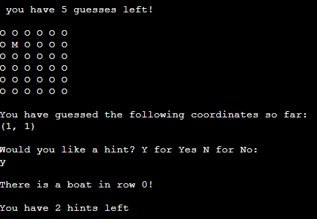

- SCORES

At the end of the game if the user manages to guess all the coordinates of both ships then the user will win and the users score will increment by 1. If the user doesn't manage to guess all the ship coordinates within max amount of guesses then the computer will win and increment the computer score by 1. The score board will then be shown to the user.

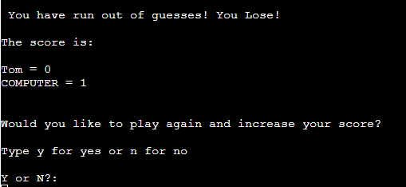

- TRY AGAIN

Once the user wins or looses, they will have the option to try again. If they input Y for yes, then the scores will keep as they are so that the user can increase their score. If they select N for no, then the game will terminate and scores will be erased.

___
## **Future Features** ##
___
- The option for the user to have their own board with ships on and the computer to guess ships on the users board.
- Giving the user to pick the size of the board and the amount of ships.
- The option to have timer to make the game more tense as the user will have to rush their guesses.
- The option to set difficulty, where easy would be a small sized board with 1 ship and hard being a large size board with multiple ships.

___
## **Testing** ##
___

### Validation Testing 

Testing has been done to make sure that only valid inputs could be put into certain inputs. For row and col, validation has been done so that the user can only enter a digit between 0-5. If the user enters any number outside of this or any letter or special character, the game will inform the user of the error and ask them to select again. Testing was done with letters incorrect numbers and special characters to make sure that the input would only take the specific digits.

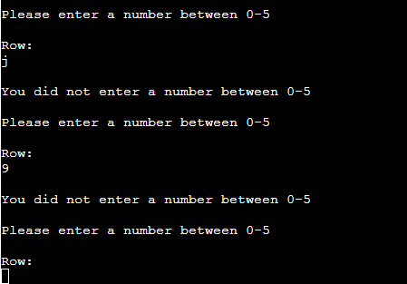

Testing was done on the hint input too. The hint input will only take a Y or N as an input. The upper function was used on the input to make sure that it didn't matter if the user used a small y or a large Y as this would be confusing if it was accepted because it wasn't capital. If anything other than Y or N is input, then an error message is printed for the user and asks them to try again using Y or N.

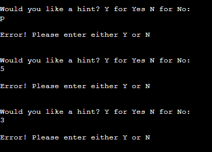

The same was done with the try again input. Nothing other than Y or N could be used. This was tested using Heroku and Github to make sure that only Y and N could be used in the input. 

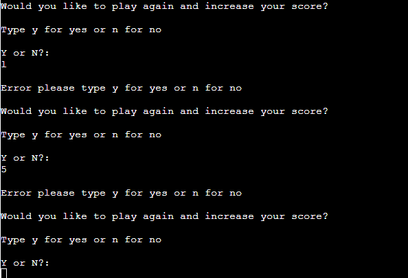

### Code Testing

- I ran my code through the PEP8 linter and that passed with no errors.
- I tested my code using the Github terminal and using the Heroku terminal. No errors. 
- All input validations work in the terminal.
- Testing was done to make sure that if 2 ships were in the same coordinates that both were removed as a print statement would inform the user if there was 2 ships.
- All inputs were testing using lowercase characters, uppercase characters, digits and special characters to make sure inputs rejected them if they were not valid for that input.
- Tested the game to make sure that if the player won or the computer won, that the score would be incremented for the correct winner. 
- Tested to see if the user decided to play again, then the scores would keep incrementing and not reset to the original 0 score.
- Tested to see if user left username blank that a username would = player so that scoreboard would be more user friendly at the end rather than blank.

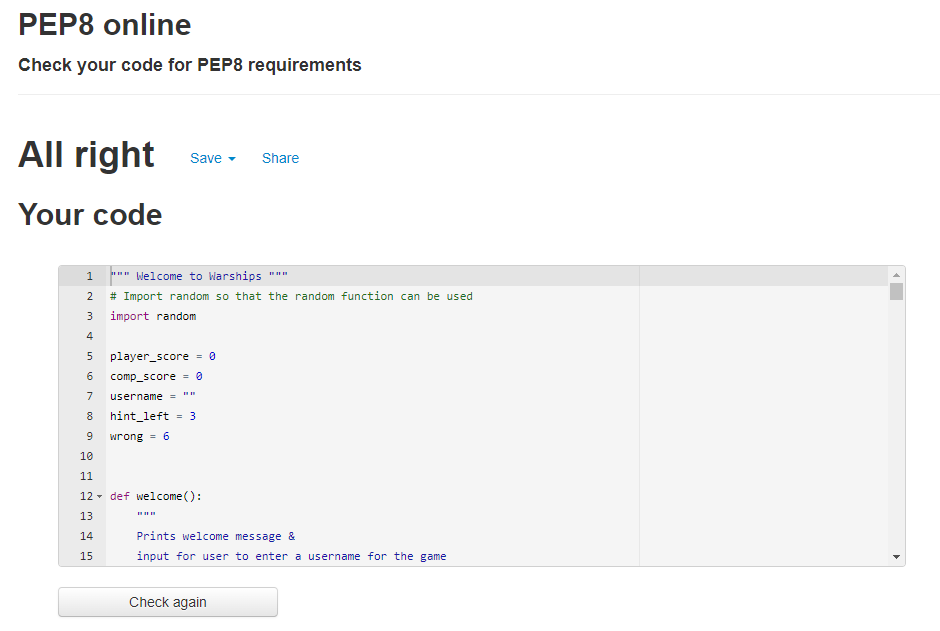


___
## **Bugs** ##
___

- A bug where the code wouldn't reject the input for row and col if it was larger than 5 or not a digit. 
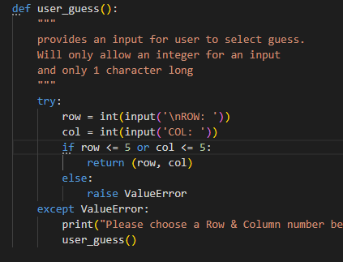
This was fixed by using the following code:
```
if not row.isdigit() or int(row) >= 6:
            print("\nYou did not enter a number between 0-5")
            continue
        else:
            row = int(row)
            break
```
- I also fixed a bug when the user sank a ship, every turn the "you have sunk a ship" print would be printed. The original code was:
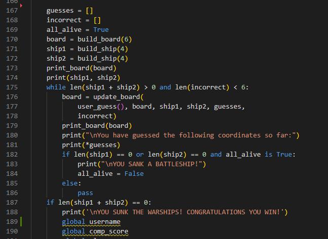
The bug was occuring because the code I was using was only reading that if ship1 length = 0 then print the statement. I fixed this by using the following code:
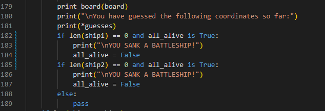
I then simplified this code so that it could be done in one statement rather than 2.
```
if (len(ship1) == 0 or len(ship2) == 0) and all_alive is True:
```
- I also had a bug where I couldn't figure out why I couldn't increment the scores for the player or computer.
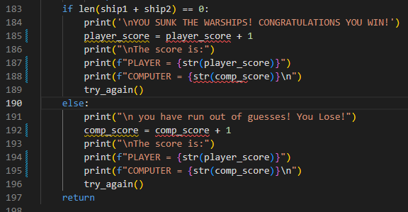
I fixed this bug as I realised I needed to use call the variable using the Global key word. Once I called the variable using the global key word, the scores would increase with a win and loss.

- **There are no known bugs remaining**

___

## **Deployment** ##
___
This project was deployed using Heroku.
- Registered for an account.
- Fork or clone this repository
- Create a new Heroku app
When you create the app, you will need to add two buildpacks from the Settings tab. The ordering is as follows:
- Python then NodeJS 
- then create a Config Var called PORT. Set this to 8000
- Link the Heroku app to the repository
- Click on Deploy
___

## **Frameworks, Libraries and Programs I Used** ##
___

- Random
___
## **Credits** ##

I used the following youtube tutorials and guides for help with the game logic and building the board.
- [Knowledge Mevans - Youtube Channel](https://www.youtube.com/watch?v=tF1WRCrd_HQ)
- [bigmonty12 - python for beginners: Battleship](https://bigmonty12.github.io/battleship)

I would also like to give credit to the slack community and the codeinstitute tutor support and my Tutor Jack for the help they have given me over this project.